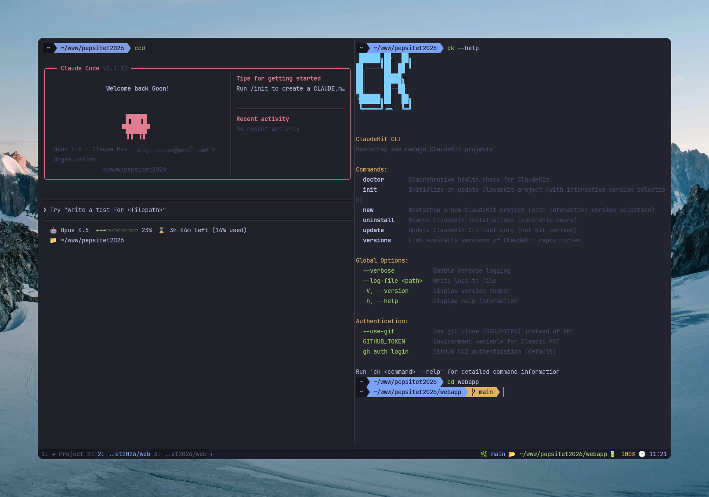

# Zuey WezTerm Config

A polished WezTerm configuration with Tokyo Night theme, status bar, and platform-native keybindings.



## Features

- **Theme**: Tokyo Night color scheme with JetBrains Mono font
- **Status Bar**: Git branch, current directory, battery, and time
- **Tab Bar**: Minimal tab bar at bottom with active tab highlight
- **Pane Splits**: Horizontal/vertical splits with easy navigation
- **Performance**: 120 FPS max, 10K scrollback lines
- **Cross-platform**: macOS (Cmd) and Windows (Ctrl) versions

## Installation

### macOS

```bash
# Backup existing config
mv ~/.wezterm.lua ~/.wezterm.lua.backup

# Copy this config
cp wezterm.lua ~/.wezterm.lua
```

### Windows (PowerShell)

```powershell
# Backup existing config
Move-Item $HOME\.wezterm.lua $HOME\.wezterm.lua.backup

# Copy Windows config
Copy-Item wezterm.win.lua $HOME\.wezterm.lua
```

> **Note**: The Windows version uses PowerShell as the default shell and `D:/www` as the default directory. Edit `config.default_prog` and `config.default_cwd` in the file to customize.

## Requirements

- [WezTerm](https://wezfurlong.org/wezterm/)
- [JetBrains Mono](https://www.jetbrains.com/lp/mono/) font

## Key Bindings

### macOS

| Shortcut | Action |
|----------|--------|
| `Cmd + D` | Split horizontally |
| `Cmd + Shift + D` | Split vertically |
| `Cmd + Alt + Arrow` | Navigate panes |
| `Cmd + Ctrl + Arrow` | Resize panes |
| `Cmd + W` | Close pane |
| `Cmd + T` | New tab |
| `Cmd + Shift + Arrow` | Navigate tabs |
| `Cmd + Z` | Zoom pane |
| `Cmd + K` | Clear scrollback |
| `Cmd + F` | Search |
| `Cmd + Shift + P` | Command palette |
| `Cmd + Shift + R` | Rename tab |
| `Cmd + Shift + X` | Copy/vim mode |
| `Cmd + Shift + Space` | Quick select (URLs, paths) |
| `Cmd + Click` | Open link |
| `Opt + Arrow` | Word navigation |
| `Cmd + Arrow` | Line start/end |
| `Cmd + Backspace` | Delete line |

### Windows

| Shortcut | Action |
|----------|--------|
| `Ctrl + D` | Split horizontally |
| `Ctrl + Shift + D` | Split vertically |
| `Ctrl + Alt + Arrow` | Navigate panes |
| `Alt + Shift + Arrow` | Resize panes |
| `Ctrl + W` | Close pane |
| `Ctrl + T` | New tab |
| `Ctrl + Shift + Arrow` | Navigate tabs |
| `Ctrl + Z` | Zoom pane |
| `Ctrl + K` | Clear scrollback |
| `Ctrl + F` | Search |
| `Ctrl + Shift + P` | Command palette |
| `Ctrl + Shift + R` | Rename tab |
| `Ctrl + Shift + X` | Copy/vim mode |
| `Ctrl + Shift + Space` | Quick select (URLs, paths) |
| `Ctrl + Click` | Open link |
| `Alt + Arrow` | Word navigation |
| `Ctrl + Arrow` | Line start/end |
| `Ctrl + Backspace` | Delete line |

## Status Bar

Shows in right status:
- Git branch (when in repo)
- Current directory
- Battery status
- Current time

## License

MIT
